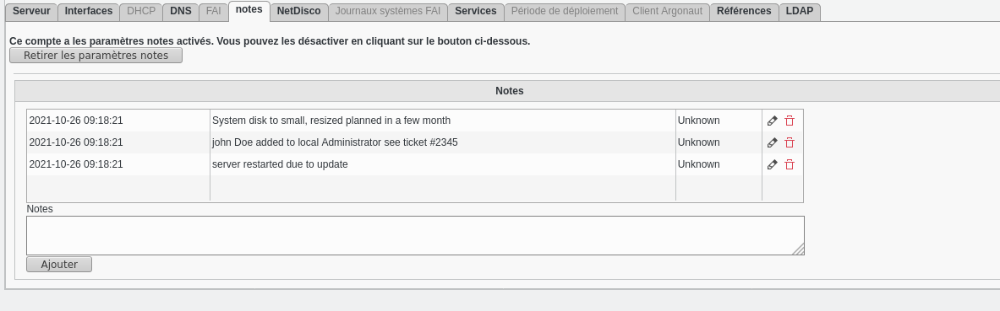

# fusiondirectory-plugins-notes

This is a plugin for FusionDirectory that add some informations about each ldap entry, it's another way to add some information in another place of Description fields

## Why this plugin ?

It was designed to system features of Fusiondirectoy.
FusionDirectory could became a simple Configuration Management DataBase and there was a lack of information like the lifcycle of component like
"2021-08-30 : I restart server due to CPU overload"

Well it's a very simple plugin but it allow to add some information wich are horodated 

## Todo
We need to fetch the current user as the author of the notes
We need to study a way to add some rich text ( like url, bold text, or bullet point )à
We need to  provide a way to disable removing and editing line .

## How to install

`git https://github.com/gallak/fusiondirectory-plugins-notes.git
mv fusiondirectory-plugins-notes notes`

### Installation of ldap schema

`ldap-schema-manager -i ./notes/contrib/schema/notes-fd.schema`

### Installation of plugin

```fusiondirectory-setup --set-fd_home=/usr/local/share/fusiondirectory --install-plugins
Setting fd_home to /usr/share/fusiondirectory
Installing FusionDirectory's plugins
Where is your plugins archive or folder?:
<complete current path>            
Available plugins:
1:notes

fusiondirectory-setup --update-cache --update-locales
```

### usage

see screenshoot




